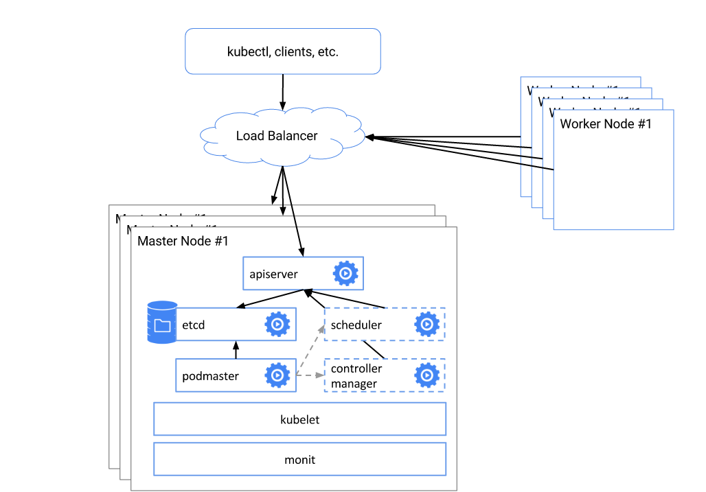
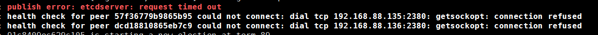

集群搭建有2种方式,系统环境和容器环境,这里使用系统环境,毕竟从基础做起.

*Master集群部署:(本例所说的master是一个包含kube-api-server  kube-scheduler
kube-controller-manager 的主节点)*

官方集群示例:

环境:

- CentOS7 minimal
- Kubernetes-v1.5.2
- Etcd-3.1.0
- Flanneld-v0.7.0
- Docker-1.12.5
- Firewalld off
- Selinux of

IP	主机名	软件环境

192.168.88.134	master-1
- kube-api-server
- kube-scheduler
- kube-controller-manager
- Etcd

192.168.88.135	master-2
- kube-api-server
- kube-scheduler
- kube-controller-manager
- Etcd

192.168.88.136	master-3
- kube-api-server
- kube-scheduler
- kube-controller-manager
- Etcd

192.168.88.142	node-1
- docker-daemon
- kube-proxy
- kubelet
- Flanneld
- nginx

192.168.88.144	node-3
- docker-daemon
- kube-proxy
- kubelet
- Flanneld

#### Etcd集群部署:
*参考文档:
https://github.com/coreos/etcd/blob/master/Documentation/op-guide/clustering.md*

    [root@master-1 ~]#  cat /etc/etcd/etcd.conf
    ETCD_CLUSTER_NAME="--name infra0"
    ETCD_CLUSTER_PEER="--initial-advertise-peer-urls http://192.168.88.134:2380"
    ETCD_CLUSTER_LISTEN_PEER="--listen-peer-urls http://192.168.88.134:2380"
    ETCD_CLUSTER_CLIENT="--listen-client-urls http://192.168.88.134:2379,http://127.0.0.1:2379"
    ETCD_CLUSTER_CLIENT_ADV="--advertise-client-urls http://192.168.88.134:2379"
    ETCD_CLUSTER_INIT_TOKEN="--initial-cluster-token etcd-cluster-1"
    ETCD_CLUSTER_CLUSTER="--initial-cluster infra0=http://192.168.88.134:2380,infra1=http://192.168.88.135:2380,infra2=http://192.168.88.136:2380"
    ETCD_CLUSTER_STATE="--initial-cluster-state new"

    [root@master-2 ~]#  cat /etc/etcd/etcd.conf
    ETCD_CLUSTER_NAME="--name infra1"
    ETCD_CLUSTER_PEER="--initial-advertise-peer-urls http://192.168.88.135:2380"
    ETCD_CLUSTER_LISTEN_PEER="--listen-peer-urls http://192.168.88.135:2380"
    ETCD_CLUSTER_CLIENT="--listen-client-urls http://192.168.88.135:2379,http://127.0.0.1:2379"
    ETCD_CLUSTER_CLIENT_ADV="--advertise-client-urls http://192.168.88.135:2379"
    ETCD_CLUSTER_INIT_TOKEN="--initial-cluster-token etcd-cluster-1"
    ETCD_CLUSTER_CLUSTER="--initial-cluster infra0=http://192.168.88.134:2380,infra1=http://192.168.88.135:2380,infra2=http://192.168.88.136:2380"
    ETCD_CLUSTER_STATE="--initial-cluster-state new"

    [root@master-3 ~]#  cat /etc/etcd/etcd.conf
    ETCD_CLUSTER_NAME="--name infra2"
    ETCD_CLUSTER_PEER="--initial-advertise-peer-urls http://192.168.88.136:2380"
    ETCD_CLUSTER_LISTEN_PEER="--listen-peer-urls http://192.168.88.136:2380"
    ETCD_CLUSTER_CLIENT="--listen-client-urls http://192.168.88.136:2379,http://127.0.0.1:2379"
    ETCD_CLUSTER_CLIENT_ADV="--advertise-client-urls http://192.168.88.136:2379"
    ETCD_CLUSTER_INIT_TOKEN="--initial-cluster-token etcd-cluster-1"
    ETCD_CLUSTER_CLUSTER="--initial-cluster infra0=http://192.168.88.134:2380,infra1=http://192.168.88.135:2380,infra2=http://192.168.88.136:2380"
    ETCD_CLUSTER_STATE="--initial-cluster-state new"
启动脚本(启动脚本三个节点一致):

    [root@master-3 ~]# cat /usr/lib/systemd/system/etcd.service
    [Unit]
    Description=Eted Server
    After=network.target

    [Service]
    WorkingDirectory=/data/etcd/
    EnvironmentFile=-/etc/etcd/etcd.conf
    ExecStart=/bin/bash -c "GOMAXPROCS=$(nproc) /usr/local/src/etcd/etcd \
            $ETCD_CLUSTER_NAME\
            $ETCD_CLUSTER_PEER\
            $ETCD_CLUSTER_LISTEN_PEER\
            $ETCD_CLUSTER_CLIENT\
            $ETCD_CLUSTER_CLIENT_ADV\
            $ETCD_CLUSTER_INIT_TOKEN\
            $ETCD_CLUSTER_CLUSTER\
            $ETCD_CLUSTER_STATE "

    Type=notify
    Restart=on-failure
    LimitNOFILE=65536

    [Install]
    WantedBy=multi-user.target

创建工作目录

    [root@master-3 ~]# mkdir -p  /data/etcd/
启动etcd集群,注意:etcd集群启动时,只有当2个或2个以上启动成功时启动状态返回0,否则启动失败;报错如下图

集群启动成功后可以查看集群状态:

    [root@master-1 log]# etcdctl cluster-health
    member 57f36779b9865b95 is healthy: got healthy result from http://192.168.88.135:2379
    member 91c8409ec629c105 is healthy: got healthy result from http://192.168.88.134:2379
    member dcd18810865eb7c9 is healthy: got healthy result from http://192.168.88.136:2379
    cluster is healthy

以及成员列表:

    [root@master-1 log]# etcdctl member list
    57f36779b9865b95: name=infra1 peerURLs=http://192.168.88.135:2380 clientURLs=http://192.168.88.135:2379 isLeader=false
    91c8409ec629c105: name=infra0 peerURLs=http://192.168.88.134:2380 clientURLs=http://192.168.88.134:2379 isLeader=false
    dcd18810865eb7c9: name=infra2 peerURLs=http://192.168.88.136:2380 clientURLs=http://192.168.88.136:2379 isLeader=true

最后在etcd集群上创建flanneld使用的网段:

    [root@master-2 ~]# etcdctl set /k8s/network/config '{ "Network": "10.1.0.0/16" }'
    [root@master-2 ~]# etcdctl get /k8s/network/config
    { "Network": "10.1.0.0/16" }

Master其他组件搭建:(3台Master配置相同)

##### Kube-api-server:
    [root@master-2 kubernetes]# grep -v "^#" apiserver config
    Config文件为通用配置,可能在其他服务中引用
    apiserver:KUBE_API_ADDRESS="--insecure-bind-address=0.0.0.0"
    apiserver:KUBE_ETCD_SERVERS="--etcd-servers=http://192.168.88.134:2379,http://192.168.88.135:2379,http://192.168.88.136:2379"
    apiserver:KUBE_SERVICE_ADDRESSES="--service-cluster-ip-range=10.254.0.0/16"
    apiserver:KUBE_ADMISSION_CONTROL="--admission-control=NamespaceLifecycle,NamespaceExists,LimitRanger,SecurityContextDeny,ResourceQuota"
    apiserver:KUBE_API_ARGS="--service_account_key_file=/usr/local/src/serviceaccount.key"
    config:KUBE_LOGTOSTDERR="--logtostderr=false"
    config:KUBE_LOG_DIR="--log-dir=/data/logs/kubernetes"
    config:KUBE_LOG_LEVEL="--v=2"
    config:KUBE_ALLOW_PRIV="--allow-privileged=false"
    config:KUBE_MASTER="--master=http://192.168.88.134:8080"

启动文件:

    [root@master-2 kubernetes]# cat /usr/lib/systemd/system/kube-apiserver.service
    [Unit]
    Description=Kubernetes API Server
    Documentation=https://github.com/GoogleCloudPlatform/kubernetes
    After=network.target
    After=etcd.service

    [Service]
    EnvironmentFile=-/etc/kubernetes/config
    EnvironmentFile=-/etc/kubernetes/apiserver
    ExecStart=/usr/local/src/kubernetes/server/bin/kube-apiserver \
       $KUBE_LOGTOSTDERR \
       $KUBE_LOG_LEVEL \
       $KUBE_ETCD_SERVERS \
       $KUBE_API_ADDRESS \
       $KUBE_API_PORT \
       $KUBE_LOG_DIR \
       $KUBELET_PORT \
       $KUBE_ALLOW_PRIV \
       $KUBE_SERVICE_ADDRESSES \
       $KUBE_ADMISSION_CONTROL \
       $KUBE_API_ARGS
    Restart=on-failure
    Type=notify
    LimitNOFILE=65536

    [Install]
    WantedBy=multi-user.target

##### kube-scheduler配置
    [root@master-2 kubernetes]# cat schedulerr
    KUBE_SCHEDULER_ARGS=""
##### 启动文件配置:
    [root@master-2 kubernetes]# cat /usr/lib/systemd/system/kube-scheduler.service
    [Unit]
    Description=Kubernetes Scheduler Plugin
    Documentation=https://github.com/GoogleCloudPlatform/kubernetes
    After=kube-apiserver.service
    Requires=kube-apiserver.service

    [Service]
    EnvironmentFile=-/etc/kubernetes/config
    EnvironmentFile=-/etc/kubernetes/scheduler
    ExecStart=/usr/local/src/kubernetes/server/bin/kube-scheduler \
                $KUBE_LOGTOSTDERR \
                $KUBE_LOG_LEVEL \
                $KUBE_LOG_DIR \
                $KUBE_MASTER \
                $KUBE_SCHEDULER_ARGS
    Restart=on-failure
    LimitNOFILE=65536

    [Install]
    WantedBy=multi-user.target

##### kube-controller-manager配置

(此处的key加密连接需要,如果不需要加密连接,可以在apiserver的配置里去掉ServiceAccount参数,初学建议去掉,可以避免很多坑)

    [root@master-2 kubernetes]# cat controller-manager
    KUBE_CONTROLLER_MANAGER_ARGS="--service_account_private_key_file=/usr/local/src/serviceaccount.key"
##### 启动脚本:
    [root@master-2 kubernetes]# cat /usr/lib/systemd/system/kube-controller-manager.service
    [Unit]
    Description=Kubernetes Controller Manager
    Documentation=https://github.com/GoogleCloudPlatform/kubernetes
    After=kube-apiserver.service
    Requires=kube-apiserver.service

    [Service]
    EnvironmentFile=-/etc/kubernetes/config
    EnvironmentFile=-/etc/kubernetes/controller-manager
    ExecStart=/usr/local/src/kubernetes/server/bin/kube-controller-manager \
       $KUBE_LOGTOSTDERR \
       $KUBE_LOG_LEVEL \
       $KUBE_LOG_DIR \
       $KUBE_MASTER \
       $KUBE_CONTROLLER_MANAGER_ARGS
    Restart=on-failure
    LimitNOFILE=65536

    [Install]
    WantedBy=multi-user.target

启动master各组件:

    [root@master-2 system]# systemctl  start kube-apiserver.service kube-controller-manager.service  kube-scheduler.service
Master之间并没有心跳检测,master时候通过etcd提供的租赁锁判定谁是leader,关于选举这块官方文档也没有提供更多的说明,当3台master部署完成后,可以用过haproxy,nginx,lvs等多种方式实现后端负载均衡,在node上只需要提供LB的地址和端口即可,本例使用的是nginx.并且nginx高可用不在本例范围内,大家可以自行研究,nginx部署在node-1节点上

##### Nginx配置
    upstream k8s-mastet {
        server master-1:8080  weight=1;
        server master-2:8080 weight=1;
        server master-3:8080 weight=1;
    	 keepalive 60;
    }
         server {
            listen       8080 ;

            root         /usr/share/nginx/html;
            location ~ / {
         	    proxy_pass http://k8s-mastet;
    			client_max_body_size 100m;
    			client_body_buffer_size 128k;
    			proxy_connect_timeout 300;
    			proxy_send_timeout 300;
          		proxy_read_timeout 300;
          		proxy_buffer_size 4k;
          		proxy_buffers 4 32k;
                 proxy_busy_buffers_size 64k;
                 proxy_temp_file_write_size 64k;
            }

启动nginx

##### Flanneld配置

    [root@node2 system]# cat /etc/sysconfig/flanneld
    FLANNEL_ETCD_ENDPOINTS="http://192.168.88.134:2379,http://192.168.88.135:2379,http://192.168.88.136:2379"
    FLANNEL_ETCD_PREFIX="/k8s/network"
    [root@node2 system]# cat /etc/sysconfig/docker-network
    # /etc/sysconfig/docker-network
    DOCKER_NETWORK_OPTIONS=
    [root@node2 system]# cat /usr/local/src/flannel/flanneld-start
    #!/bin/sh

    exec /usr/local/src/flannel/flanneld \
    -etcd-endpoints=${FLANNEL_ETCD_ENDPOINTS:-${FLANNEL_ETCD}} \
    -etcd-prefix=${FLANNEL_ETCD_PREFIX:-${FLANNEL_ETCD_KEY}} \
    "$@"

启动脚本配置:

    [root@node2 system]# cat flanneld.service
    [Unit]
    Description=Flanneld overlay address etcd agent
    After=network.target
    After=network-online.target
    Wants=network-online.target
    After=etcd.service

    [Service]
    Type=notify
    EnvironmentFile=/etc/sysconfig/flanneld
    EnvironmentFile=-/etc/sysconfig/docker-network
    ExecStart=/usr/local/src/flannel/flanneld-start $FLANNEL_OPTIONS
    ExecStartPost=/usr/local/src/flannel/mk-docker-opts.sh -k DOCKER_NETWORK_OPTIONS -d /run/flannel/docker
    Restart=on-failure

    [Install]
    WantedBy=multi-user.target
    RequiredBy=docker.service

Docker启动文件修改

    [root@node2 system]# cat /usr/lib/systemd/system/docker.service
    [Unit]
    Description=Docker Application Container Engine
    Documentation=http://docs.docker.com
    After=network.target
    Wants=docker-storage-setup.service
    Wants=flanneld.service(这句话表示启动docker之前flanneld服务已经启动.但是不强制要求)
    [Service]
    Type=notify
    NotifyAccess=all
    EnvironmentFile=-/etc/sysconfig/docker
    EnvironmentFile=-/etc/sysconfig/docker-storage
    EnvironmentFile=-/etc/sysconfig/docker-network
    EnvironmentFile=-/run/flannel/docker[一定要加上这个,我没加遇到很多坑]
    Environment=GOTRACEBACK=crash
    Environment=DOCKER_HTTP_HOST_COMPAT=1
    Environment=PATH=/usr/libexec/docker:/usr/bin:/usr/sbin
    ExecStart=/usr/bin/dockerd-current \
              --add-runtime docker-runc=/usr/libexec/docker/docker-runc-current \
              --default-runtime=docker-runc \
              --exec-opt native.cgroupdriver=systemd \
              --userland-proxy-path=/usr/libexec/docker/docker-proxy-current \
              $OPTIONS \
              $DOCKER_STORAGE_OPTIONS \
              $ADD_REGISTRY \
              $BLOCK_REGISTRY \
              $INSECURE_REGISTRY \
              (下面4项一定要加上,这几个变量来自/run/flannel/docker)
    	  $DOCKER_OPT_BIP \
    	  $DOCKER_OPT_IPMASQ \
    	  $DOCKER_OPT_MTU \
    	  $DOCKER_NETWORK_OPTIONS
    ExecReload=/bin/kill -s HUP $MAINPID
    LimitNOFILE=1048576
    LimitNPROC=1048576
    LimitCORE=infinity
    TimeoutStartSec=0
    Restart=on-abnormal
    MountFlags=slave

    [Install]
    WantedBy=multi-user.target

    [root@node2 system]# cat /run/flannel/docker
    注意:本文件由flanneld网络启动后生成
    DOCKER_OPT_BIP="--bip=10.1.96.1/24"
    DOCKER_OPT_IPMASQ="--ip-masq=true"
    DOCKER_OPT_MTU="--mtu=1472"
    DOCKER_NETWORK_OPTIONS=" --bip=10.1.96.1/24 --ip-masq=true --mtu=1472"

注意:flanneld必须要在docker-daemon启动之前启动,docker-daemon提供的docker0虚拟网卡必须是flanneld提供的子网:如下:

    [root@node2 system]# ip a
    ...
    3: docker0: <BROADCAST,MULTICAST,UP,LOWER_UP> mtu 1500 qdisc noqueue state UP
        link/ether 02:42:ab:c2:b2:5f brd ff:ff:ff:ff:ff:ff
        inet 10.1.100.1/24 scope global docker0
           valid_lft forever preferred_lft forever
        inet6 fe80::42:abff:fec2:b25f/64 scope link
           valid_lft forever preferred_lft forever
    ...
    7: flannel0: <POINTOPOINT,MULTICAST,NOARP,UP,LOWER_UP> mtu 1472 qdisc pfifo_fast state UNKNOWN qlen 500
        link/none
        inet 10.1.100.0/16 scope global flannel0
           valid_lft forever preferred_lft forever

配置Kubernetes-Node其他组件
##### Kubelet配置:

           [root@node2 kubernetes]# grep -vE "#|^$"  config kubelet
           config:KUBE_LOGTOSTDERR="--logtostderr=false"
           config:KUBE_LOG_DIR="--log-dir=/data/logs/kubernetes"
           config:KUBE_LOG_LEVEL="--v=2"
           config:KUBE_ALLOW_PRIV="--allow-privileged=false"
           config:KUBE_MASTER="--master=http://192.168.88.142:8080"
           kubelet:KUBELET_ADDRESS="--address=0.0.0.0"
           kubelet:KUBELET_PORT="--port=10250"
           kubelet:KUBELET_HOSTNAME="--hostname-override=k8s-node1"
           kubelet:KUBELET_API_SERVER="--api-servers=http://192.168.88.142:8080"
           kubelet:KUBELET_POD_INFRA_CONTAINER="--pod-infra-container-image=registry.access.redhat.com/rhel7/pod-infrastructure:latest"
           kubelet:KUBELET_ARGS=""

启动脚本文件:

           [root@node2 system]# cat kubelet.service
           [Unit]
           Description=Kubernetes Kubelet Server
           Documentation=https://github.com/GoogleCloudPlatform/kubernetes
           After=docker.service
           Requires=docker.service

           [Service]
           WorkingDirectory=/data/kubelet
           EnvironmentFile=-/etc/kubernetes/config
           EnvironmentFile=-/etc/kubernetes/kubelet
           ExecStart=/usr/local/src/kubernetes/client/bin/kubelet \
              $KUBE_LOGTOSTDERR \
              $KUBE_LOG_LEVEL \
              $KUBE_LOG_DIR \
              $KUBELET_API_SERVER \
              $KUBELET_ADDRESS \
              $KUBELET_PORT \
              $KUBELET_HOSTNAME \
              $KUBE_ALLOW_PRIV \
              $KUBELET_POD_INFRA_CONTAINER \
              $KUBELET_ARGS
           Restart=on-failure

           [Install]
           WantedBy=multi-user.target

##### kube-proxy配置:

           config:KUBE_LOGTOSTDERR="--logtostderr=false"
           config:KUBE_LOG_DIR="--log-dir=/data/logs/kubernetes"
           config:KUBE_LOG_LEVEL="--v=2"
           config:KUBE_ALLOW_PRIV="--allow-privileged=false"
           config:KUBE_MASTER="--master=http://192.168.88.142:8080"
           proxy:KUBE_PROXY_ARGS=""

##### 启动文件:

           [root@node2 system]# cat kube-proxy.service
           [Unit]
           Description=Kubernetes Kube-Proxy Server
           Documentation=https://github.com/GoogleCloudPlatform/kubernetes
           After=network.target

           [Service]
           EnvironmentFile=-/etc/kubernetes/config
           EnvironmentFile=-/etc/kubernetes/proxy
           ExecStart=/usr/local/src/kubernetes/client/bin/kube-proxy \
              $KUBE_LOGTOSTDERR \
              $KUBE_LOG_LEVEL \
              $KUBE_LOG_DIR \
              $KUBE_MASTER \
              $KUBE_PROXY_ARGS
           Restart=on-failure
           LimitNOFILE=65536

           [Install]
           WantedBy=multi-user.target

Node3的配置与Node1完全一样,不在赘述:

启动相应的组件

    [root@node2 system]# systemctl start kubelet.service  kube-proxy.service  flanneld.service docker.service

在nginx所在的节点获取Node状态:

    [root@node2 system]# kubectl get no
    NAME        STATUS    AGE
    k8s-node1   Ready     19h
    k8s-node3   Ready     19h

测试集群leader漂移的情况:

    kubectl describe[get]  ep -n kube-system  kube-controller-manager kube-scheduler [-o yaml|json]

观察令牌持有者:

    kubectl get  ep -n kube-system  kube-controller-manager kube-scheduler -o yaml
    kube-controller-manager:
     control-plane.alpha.kubernetes.io/leader: '{"holderIdentity":"master-2","leaseDurationSeconds":15,"acquireTime":"2017-03-15T03:18:51Z","renewTime":"2017-03-15T06:09:39Z","leaderTransitions":0}'
    kube-scheduler
    control-plane.alpha.kubernetes.io/leader: '{"holderIdentity":"master-2","leaseDurationSeconds":15,"acquireTime":"2017-03-15T03:18:50Z","renewTime":"2017-03-15T06:09:38Z","leaderTransitions":0}'

- describe查看时仅在有event的时候可以看到leader变化.
- kube-scheduler和kube-controller-manager持有不同的令牌,所以两者leader可能不在一个节点上.

##### Kubernetes-dashboard(容器化):
    [root@node1 system]# cat service_UI.yaml
    apiVersion: v1
    kind: Service
    metadata:
      name: k8s-ui
      namespace: kube-system
      labels:
        name: k8s-ui
    spec:
      type: NodePort
      ports:
      - port: 9090
        nodePort: 30005
      selector:
        name: k8sui
    [root@node1 system]# cat k8s_ui.yaml
    apiVersion: v1
kind: ReplicationController
metadata:
  name: k8s-ui
  namespace: kube-system
spec:
  replicas: 1
  selector:
    name: k8sui
  template:
    metadata:
      labels:
        name: k8sui
    spec:
      containers:
        - name: k8sui
          image: docker.io/mritd/kubernetes-dashboard-amd64
          imagePullPolicy: IfNotPresent
          args:
            - --apiserver-host=http://192.168.88.134:8080
          ports:
            - containerPort: 9090

后记:一些遇到的坑,和一些使用技巧:

1.前面文中提到的加密认证:报错如下:

Error from server: error when creating "nginx.yaml": Pod "nginx" is forbidden: no API token found for service account default/default, retry after the token is automatically created and added to the service account

解决方法有2种:

- 编辑apiserver的配置文件去除--admission_control参数中的SecurityContextDeny,ServiceAccount参数并重启kube-apiserver.service服务：
- 解决认证(注意中英文标点,我是直接cp的)

*出处：            http://stackoverflow.com/questions/34464779/pod-mysql-is-forbidden-no-api-token-found-for-service-account-default-default*

            1).Generate a signing key:
            openssl genrsa -out /tmp/serviceaccount.key 2048

            2).Update /etc/kubernetes/apiserver:
            KUBE_API_ARGS=”--service_account_key_file=/tmp/serviceaccount.key”

            3).Update /etc/kubernetes/controller-manager:
            KUBE_CONTROLLER_MANAGER_ARGS=”service_account_private_key_file=/tmp/serviceaccount.key”

资源调配(设置默认,LimitRange是和Namespace捆绑的,每个Namespace都可以关联一个不用的LimitRange)
ex:(file:pod-container-limits.yaml)

            apiVersion: v1
            kind: LimitRange
            metadata:
              name: limit-range-1
            spec:
              limits:
                - type: "Pod"
                  max:
                    cpu: "2"
                    memory: 1Gi
                  min:
                    cpu: 250m
                    memory: 32Mi
                - type: "Container"
                  max:
                    cpu: "2"
                    memory: "1Gi"
                  min:
                    cpu: "250m"
                    memory: "32Mi"
                  default:
                    cpu: "250m"
                    memory: "64Mi"		

多用户配额(指定配额后必须在pod里明确资源使用)
1.创建相应的命名空间
ex:(file:namespace-develoment.yaml):

            apiVersion: v1
            kind: Namespace
            metadata:
              name: develoment

2创建(ResourceQuota)限定资源对象:

            ex:(file:resoucequota-develoment.yaml):
            apiVersion: v1
            kind: ResourceQuota
            metadata:
              name: quota-develoment
              namespace: develoment
            spec:
              hard:
                cpu: "32"
            	memory: 256Gi
            	persistentvolumeclaims: "10"
                pods: "100"
            	replicationcontrollers: "50"
            	resourcequotas: "1"
            	secrets: "20"
            	services: "50"

ex:(file:nginx-rc.yml)

            apiVersion: v1
            kind: ReplicationController
            metadata:
              name: nginx-rc
              namespace: develoment
            spec:
              replicas: 3
              selector:
                name: nginx
              template:
                metadata:
                  labels:
                    name: nginx
                spec:
                  containers:
                    - name: nginx
                      image: docker.io/nginx
                      imagePullPolicy: IfNotPresent
                      resources:
                        limits:
                          cpu: "2"
                          memory: 1Gi

不同节点上pod相互通信网络示例:

官方提供的下载脚本

[跳转至脚本](sh/download.sh)
