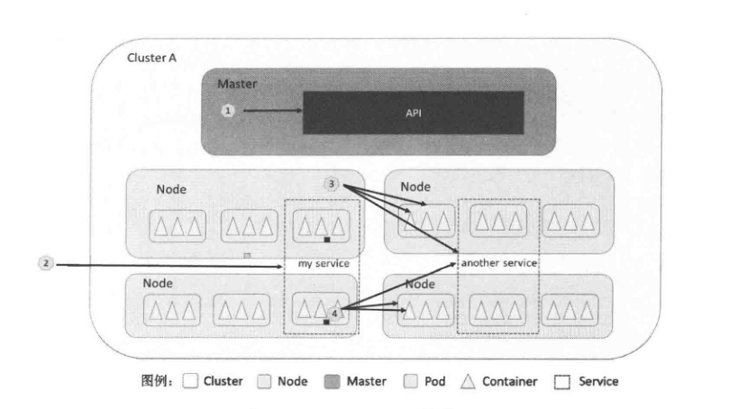

**k8s架构图**

组件名词解释:

**[Master]**
- scheduler:集群种的调度器,负责Pod在集群种节点的调度分配
- controller-manager:集群内部的管理控制中心,其主要目的是实现Kubernetes集群的故障检测和恢复自动化工作
- api-server:提供kubernetes集群的API调用,为集群资源对象的唯一操作入口,其他所有组件都必须通过它提供的API来操作资源数据,通过对相关数据”全量查询”+”变化监听”,这些组件可以很实时的完成相关的业务功能.
- flannel: 实现夸主机的容器网络的通信
- etcd:一个高可用的K/V键值对存储和服务发现系统,用于持久化存储集群种所有的资源对象,例如集群种的Node,Service,Pod,RC,Namespace等,关于master集群,集群使用lease-lock漂移来实现leader选举(原文:we are going to use a lease-lock in the API to perform master election)

**[Node]**:
- docker-daemon: docker
- proxy:实现Service的代理及软件模式的负载均衡器
- kubelet:负责本节点上的Pod的创建,修改,监控,销毁等全生命周期管理,同事定时上报本节点的状态信息到API Server

集群名词解释:

**Pod**:

是kubernetes最基本的操作单元,一个Pod可能包含多个容器,相同Pod内的容器可以通过localhost进行通信,但是端口不能相同,Pod在Node上被创建,启动或销毁,Pod不能跨Node,Pod容器和Node之间的关系如下图:

 

 一个Pod种的应用容器共享同一组资源:
- PID命名空间:Pod种的不用应用程序可以看到其他应用程序的进程ID
- 网络命名空间:Pod种的多个容器能够访问同一个IP和端口范围
- IPC命名空间:Pod种的多个容器能使用SystemV IPC或POSIX消息队列进行通信
- UTS命名空间:Pod种的多个容器共享一个主机名
- Volumes(共享存储卷):Pod种的各个容器可以访问在Pod级别定义的Volumes

Pod状态:
- Pending:Pod定义正确,提交到Master,但是所需的容器镜像未完全创建
- Running:Pod已经被村配到某个Node上,其包含的容器镜像已经创建完成
- Terminied:Pod正在终止
- Failed(err &.):Pod种所有容器都结束了,但至少一个容器是以失败状态结束的.
- 其它(参考文献比较旧,后面补充)

每一个副本都会有与之对应的docker pod 容器运行,其作用:(同一个pod内的容器之间可以通过localhost相互通信)

**Service**:

  Kubernetes虽然会对每一个Pod分配一个单独的IP地址,但是这个IP地址会随着Pod的销毁而消失,如果有一组Pod组成一个集群来提供服务,那么如何来访问他呢,Service就是用来解决这个问题的.

Service可以跨Node运行;Node,Pod,Service,Container关系如下图:

在Pod正常启动后,系统会根据Service的定义创建出于Pod对应的Endpoint对象,以建立起Service与后端Pod的对应关系,随着Pod的创建,销毁,Endpoint对象也将被更新,Endpoint对象主要由Pod的IP地址和容器需要监听的端口号组成,通过kubectl get endpoint可以查看.Service定义的IP(下文简称SVIP)只能在内部(即Pod之间,Service之间)访问;如果要从外部访问,我们只需要将这个Service的端口开放到出去即可(每个节点都会启动相应的端口),Kubernetes支持2种对外服务的Service的type定义:NodePort和LoadBalancer

**NodePort**:

在定义Service时指定spec.type=NodePort,兵指定spec.ports.nodePort值,系统会在集群种的每个Node上打开一个主机上的真实端口号,这样能放问Node的客户端都能通过任意一个Node来访问这个端口,进而访问内部的Service.

**LoadBalancer**:
如果云服务商支持外接负载均衡器,则可以通过spec.type=LoadBalancer定义Service,同时需要指定负载均衡器的IP,同事还需要指定Service的NodePort和clusterIP.

**Replication Controller(RC)**:

RC(简写)用于定义Pod的副本数量,在Master内,Controller Manager进程通过RC的定义来完成Pod的创建,监控,销毁等操作(Pod也可以单独启动);  Kubernetes能确保在任意时刻都能运行用户指定的”副本”(Replica)数量,如果有过多的Pod副本在运行.系统就会停掉一些;如果Pod数量少于指定数量,系统就会再启动一些Pod

**Label**:

Label是Kubernetes系统中的一个核心概念;Label以key/value的键值对的形式附加到各种对象上,如Pod,Service,RC,Node等,Label定义了这些对象的可识别属性,用来对它们进行管理和选择,Label可以在创建对象时附加到对象上,也可以在对象创建后通过API管理,在为对象定义好Label后,其他对象可以使用Label Selector来定义其作用对象.(详细参考Kubernetes权威指南第1版第21页)

**Volume(存储卷)**:

Volume是Pod种能够被多个容器访问的共享目录,Kubernetes种的Volume与Pod的生命周期相同,与容器的生命周期不想关,当容器终止会重启时,Volume种的数据不会丢失.

**Namespace(命名空间)**:

Namespace是Kubernetes系统中一个很重要的概念,通过系统内部的对象分配到不容的Namespace中,形成逻辑上分组不通的项目,小组或用户组,便于不同的分组在共享使用整个集群资源的同时还能被分别管理

**Endpoint**:

保留:暂时不知道怎么解释

集群中的一些简写:
  * componentstatuses (aka 'cs')  
  * configmaps (aka 'cm')  
  * daemonsets (aka 'ds')  
  * deployments (aka 'deploy')  
  * endpoints (aka 'ep')  
  * events (aka 'ev')  
  * horizontalpodautoscalers (aka 'hpa')  
  * ingresses (aka 'ing')   
  * limitranges (aka 'limits')  
  * namespaces (aka 'ns')  
  * nodes (aka 'no')  
  * persistentvolumeclaims (aka 'pvc')  
  * persistentvolumes (aka 'pv')  
  * pods (aka 'po')  
  * podsecuritypolicies (aka 'psp')  
  * replicasets (aka 'rs')  
  * replicationcontrollers (aka 'rc')  
  * resourcequotas (aka 'quota')  
  * serviceaccounts (aka 'sa')  
  * services (aka 'svc')

比如 kubectl get nodes 可以简写为kubectl get no

参考文献:<<Kubernetes权威指南>>第一版
