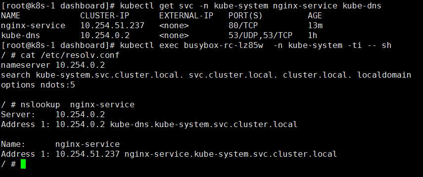

还是先传yaml文件吧

[跳转至下载页面](yaml/DNS)

#### 第一步 创建ConfigMap

    [root@k8s-1 kubedns]# cat kubedns-cm.yaml
    apiVersion: v1
    kind: ConfigMap
    metadata:
      name: kube-dns
      namespace: kube-system
      labels:
        addonmanager.kubernetes.io/mode: EnsureExists

#### 第二步 创建ServiceAccount

    [root@k8s-1 kubedns]# cat kubedns-sa.yaml
    apiVersion: v1
    kind: ServiceAccount
    metadata:
      name: kube-dns
      namespace: kube-system
      labels:
        kubernetes.io/cluster-service: "true"
        addonmanager.kubernetes.io/mode: Reconcile

#### 第三步 创建Service

    [root@k8s-1 kubedns]# cat kubedns-svc.yaml
    apiVersion: v1
    kind: Service
    metadata:
      name: kube-dns
      namespace: kube-system
      labels:
        k8s-app: kube-dns
        kubernetes.io/cluster-service: "true"
        addonmanager.kubernetes.io/mode: Reconcile
        kubernetes.io/name: "KubeDNS"
    spec:
      selector:
        k8s-app: kube-dns
      clusterIP: 10.254.0.2
      ports:
      - name: dns
        port: 53
        protocol: UDP
      - name: dns-tcp
        port: 53
        protocol: TCP

#### 第四部 创建RC(重要)

注意事项:

   1.需要将kubeconfig文件挂载至容器内部,本文的此文件路径为/etc/kubeconfig/config2

   2.需要将/etc/hosts挂载到容器内部.因为apiserver认证时不能用IP(证书里面没写IP)

   3.k8s-dns-kube-dns-amd64容器启动时必须加--kubecfg-file=/etc/kubernetes/config2参数

  --kubecfg-file 参数说明:

     --kubecfg-file string Location of kubecfg file for access to kubernetes master service; --kube-master-url overrides the URL part of this;if this is not provided, defaults to service account tokens

[root@k8s-1 kubedns]# cat kubedns-controller.yaml

    apiVersion: extensions/v1beta1
    kind: Deployment
    metadata:
      name: kube-dns
      namespace: kube-system
      labels:
        k8s-app: kube-dns
        kubernetes.io/cluster-service: "true"
        addonmanager.kubernetes.io/mode: Reconcile
    spec:
      # replicas: not specified here:
      # 1. In order to make Addon Manager do not reconcile this replicas parameter.
      # 2. Default is 1.
      # 3. Will be tuned in real time if DNS horizontal auto-scaling is turned on.
      strategy:
        rollingUpdate:
          maxSurge: 10%
          maxUnavailable: 0
      selector:
        matchLabels:
          k8s-app: kube-dns
      template:
        metadata:
          labels:
            k8s-app: kube-dns
          annotations:
            scheduler.alpha.kubernetes.io/critical-pod: ''
        spec:
          tolerations:
          - key: "CriticalAddonsOnly"
            operator: "Exists"
          volumes:
          - hostPath:
             path: /etc/kubernetes  #提供挂载卷
            name: ssl-certs-kubernetess
          - hostPath:   #提供挂载文件
             path: /etc/hosts
            name: ssl-certs-hosts
          - name: kube-dns-config
            configMap:
              name: kube-dns
              optional: true
          containers:
          - name: kubedns
            image: index.tenxcloud.com/jimmy/k8s-dns-kube-dns-amd64:1.14.1
            imagePullPolicy: IfNotPresent
            resources:
              # TODO: Set memory limits when we've profiled the container for large
              # clusters, then set request = limit to keep this container in
              # guaranteed class. Currently, this container falls into the
              # "burstable" category so the kubelet doesn't backoff from restarting it.
              limits:
                memory: 170Mi
              requests:
                cpu: 100m
                memory: 70Mi
            livenessProbe:
              httpGet:
                path: /healthcheck/kubedns
                port: 10054
                scheme: HTTP
              initialDelaySeconds: 60
              timeoutSeconds: 5
              successThreshold: 1
              failureThreshold: 5
            readinessProbe:
              httpGet:
                path: /readiness
                port: 8081
                scheme: HTTP
              # we poll on pod startup for the Kubernetes master service and
              # only setup the /readiness HTTP server once that's available.
              initialDelaySeconds: 3
              timeoutSeconds: 5
            args:
            - --domain=cluster.local.
            - --dns-port=10053
            - --config-dir=/kube-dns-config
            - --v=2
            - --kubecfg-file=/etc/kubernetes/config2  ##配置启动参数,必须
            #__PILLAR__FEDERATIONS__DOMAIN__MAP__
            env:
            - name: PROMETHEUS_PORT
              value: "10055"
            ports:
            - containerPort: 10053
              name: dns-local
              protocol: UDP
            - containerPort: 10053
              name: dns-tcp-local
              protocol: TCP
            - containerPort: 10055
              name: metrics
              protocol: TCP
            volumeMounts:
            - name: kube-dns-config
              mountPath: /kube-dns-config
            - name: ssl-certs-kubernetess
              mountPath: /etc/kubernetes
              readOnly: true
            - name: ssl-certs-hosts
              mountPath: /etc/hosts
              readOnly: true

          - name: dnsmasq
            image: index.tenxcloud.com/jimmy/k8s-dns-dnsmasq-nanny-amd64:1.14.1
            imagePullPolicy: IfNotPresent
            livenessProbe:
              httpGet:
                path: /healthcheck/dnsmasq
                port: 10054
                scheme: HTTP
              initialDelaySeconds: 60
              timeoutSeconds: 5
              successThreshold: 1
              failureThreshold: 5
            args:
            - -v=2
            - -logtostderr
            - -configDir=/etc/k8s/dns/dnsmasq-nanny
            - -restartDnsmasq=true
            - --
            - -k
            - --log-facility=-
            - --cache-size=1000
            - --server=/cluster.local./127.0.0.1#10053
            - --server=/in-addr.arpa/127.0.0.1#10053
            - --server=/ip6.arpa/127.0.0.1#10053
            ports:
            - containerPort: 53
              name: dns
              protocol: UDP
            - containerPort: 53
              name: dns-tcp
              protocol: TCP
            # see: https://github.com/kubernetes/kubernetes/issues/29055 for details
            resources:
              requests:
                cpu: 150m
                memory: 20Mi
            volumeMounts:
            - name: kube-dns-config
              mountPath: /etc/k8s/dns/dnsmasq-nanny
          - name: sidecar
            image: index.tenxcloud.com/jimmy/k8s-dns-sidecar-amd64:1.14.1
            imagePullPolicy: IfNotPresent
            livenessProbe:
              httpGet:
                path: /metrics
                port: 10054
                scheme: HTTP
              initialDelaySeconds: 60
              timeoutSeconds: 5
              successThreshold: 1
              failureThreshold: 5
            args:
            - --v=2
            - --logtostderr
            - --probe=kubedns,127.0.0.1:10053,kubernetes.default.svc.cluster.local.,5,A
            - --probe=dnsmasq,127.0.0.1:53,kubernetes.default.svc.cluster.local.,5,A
            ports:
            - containerPort: 10054
              name: metrics
              protocol: TCP
            resources:
              requests:
                memory: 20Mi
                cpu: 10m
          dnsPolicy: Default  # Don't use cluster DNS.
          serviceAccountName: kube-dns  #这里是连接apiserver使用的账户

last:效果图

##### 创建kubectl kubeconfig文件,此文件用于kubectl 各项操作,

* 默认生成路径为~/.kube/config,也可以用于dashboard,DNS的https认证,直接拷贝使用,我是直接拷贝到/etc/kubernetes/config2,然后挂载到容器里面作为dashboard的启动参数使用的. 如本文--kubecfg-file=/etc/kubernetes/config2

    export KUBE_APISERVER="https://k8s-2:6443"
    $ # 设置集群参数
    $ kubectl config set-cluster kubernetes \
    --certificate-authority=/etc/kubernetes/ssl/ca.pem \
    --embed-certs=true \
    --server=${KUBE_APISERVER}

    $ # 设置客户端认证参数

    $ kubectl config set-credentials admin \
    --client-certificate=/etc/kubernetes/ssl/admin.pem \
    --embed-certs=true \
    --client-key=/etc/kubernetes/ssl/admin-key.pem

    $ # 设置上下文参数

    $ kubectl config set-context kubernetes \
    --cluster=kubernetes \
    --user=admin

    $ # 设置默认上下文

    $ kubectl config use-context kubernetes
